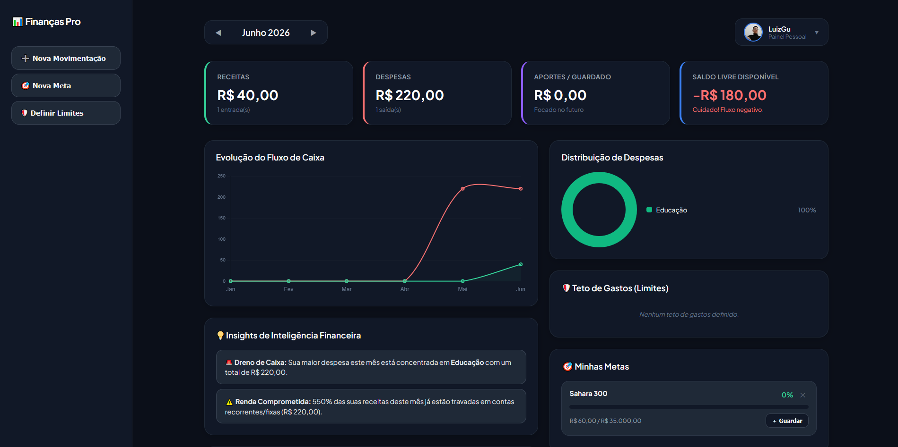
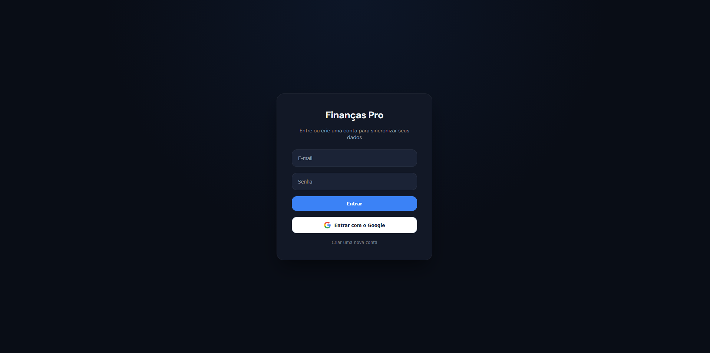

# 📊 Finanças Pro - Dashboard Financeiro Pessoal


O **Finanças Pro** é um ecossistema completo de controle financeiro pessoal, desenvolvido com tecnologias front-end puras e integrado ao Firebase para persistência de dados em tempo real. O foco principal é a usabilidade, permitindo gerenciar receitas, despesas, monitorar metas e visualizar o fluxo de caixa de forma automatizada.
---

[**Live Demo 🚀**](https://fafa-dev18.github.io/Dashboard/)

---


## 📸 Demonstração do Projeto

<div align="center">
  <p><b>Visão Geral do Dashboard (Modo Escuro)</b></p>
  
</div>

<br>

<div align="center">
  <p><b>Tela de log-in</b></p>
  
</div>

---

## ✨ Funcionalidades Principais

* **🔐 Autenticação Segura:** Login manual (E-mail/Senha) e integração nativa com o **Google Sign-In**.
* **📂 Separação por Usuário:** Banco de dados nuvem estruturado via *Firestore Rules* — seus dados são visíveis apenas por você.
* **📈 Gráficos Interativos:** Gráfico de rosca para distribuição de gastos por categoria e gráfico de linhas para tendências de receitas vs. despesas (via `Chart.js`).
* **🎯 Metas com Lógica de Aporte:** Ao poupar dinheiro para uma meta, o sistema gera **automaticamente** um lançamento de saída na categoria "Investimentos", atualizando seu saldo na hora.
* **📅 Calendário de Transações:** Linha do tempo visual em formato de calendário indicando os dias com movimentações de entrada (verde) e saída (vermelho).
* **🔄 Transações Recorrentes:** Suporte a lançamentos fixos que se repetem automaticamente nos meses seguintes.

---

## 🛠️ Tecnologias Utilizadas

A arquitetura do projeto foi desenhada para ser leve e performática, sem a necessidade de frameworks complexos:

| Tecnologia | Função |
| :--- | :--- |
| **HTML5 & CSS3** | Estruturação e estilização customizada (Interface Dark/Modern). |
| **JavaScript (ES6+)** | Lógica de negócios, manipulação do DOM e módulos assíncronos. |
| **Firebase Auth** | Gerenciamento de sessões e autenticação de usuários. |
| **Cloud Firestore** | Banco de dados NoSQL para sincronização em tempo real. |
| **Chart.js** | Renderização dos gráficos de análise financeira. |
| **Vercel** | Hospedagem de alta performance e Deploy Contínuo (CI/CD). |

---

## 🛡️ Segurança e Boas Práticas

As chaves de configuração do Firebase expostas no código atuam estritamente como identificadores públicos. A segurança bruta do projeto é garantida pelas **Regras de Segurança do Firestore**:

```javascript
rules_version = '2';
service cloud.firestore {
  match /databases/{database}/documents {
    match /users_data/{userId} {
      allow read, write: if request.auth != null && request.auth.uid == userId;
    }
  }
}
